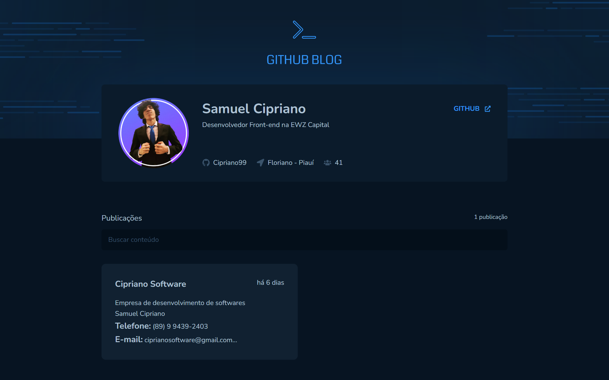
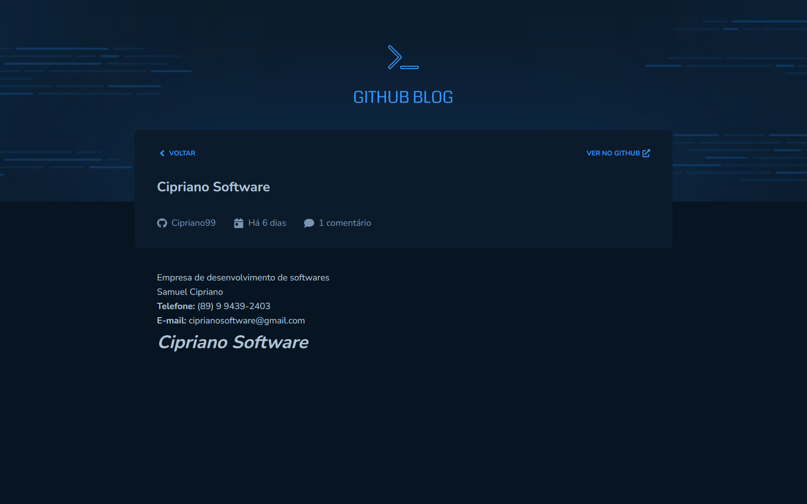

# Ignite - Desafio: GitHub Blog

Aplicação desenvolvida no programa de especialização chamado Ignite, da [Rocketseat](https://rocketseat.com.br/).

## Tecnologias utilizadas

- [ReactJs](https://pt-br.reactjs.org/)
- [Vite](https://vitejs.dev/)
- [TypeScript](https://www.typescriptlang.org/)
- [ESLint](https://eslint.org/)
- [React Router](https://reactrouter.com/)
- [Axios](https://axios-http.com/ptbr/)
- [Styled Components](https://styled-components.com/)
- [React Hook Form](https://react-hook-form.com/)
- [date-fns](https://date-fns.org/)
- [React Markdown](https://remarkjs.github.io/react-markdown/)

## Telas da aplicação

**Tela inicial**

**Página do post**

